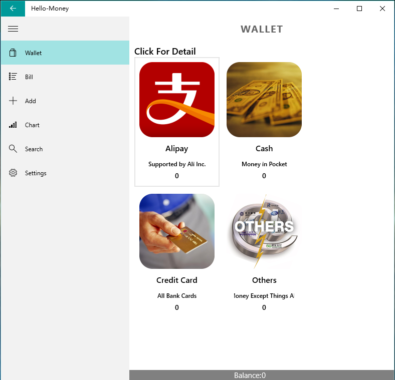

#Hello Money
#2015年同济大学Windows期末课程项目设计


## 项目简介

#### Hello-Money是一款轻便易用的UWP平台记账工具，初衷是帮助『月光族』管理个人账务。同时，UWP平台还没有比较好的类似软件，因此选择UWP平台开发。


##开发环境：
* <strong>Windows 10</strong>
* <strong>Visual studio 2015 </strong>


## 使用方法
#### 将项目clone到本地，配置好所需要的环境（VS会提示）
```
# cd到期望路径，然后执行
$ git clone https://github.com/anzhehong/Hello-Money
```


## 基本功能
### 1.记录收入支出
#### 可分类记，也可分账本记

### 2.显示账单（分为月账单和年账单）
### 3.图表显示收入支出状况
- pie chart

- bar chart

- line chart


### 4.分类记账，显示每个账本的收入支出情况

### 5.搜索账单

### 6.Cortana唤醒
##### 启动命令：
> 打开账本记账

### 7.设置界面

#### 通过设置界面可以
- 设置预算
- 更改黑白两种主题
- 清空数据
- 功能简介


## TODO
1. 引入OneDrive SDK作为云同步方式
2. 修复已知和未知BUG
3. 用户可以自定义账本和收入支出方式


##Members:
<strong><a href="https://github.com/Yiiinsh">鄞劭涵</a>,
<strong><a href="https://github.com/yue9944882">金敏</a>,
<strong><a href="https://github.com/HermanZzz">张航</a>

## 致谢
1. 感谢麦子学院相关winphone课程对我们Windows开发的启蒙
2. 感谢何老师没喷我们！！！